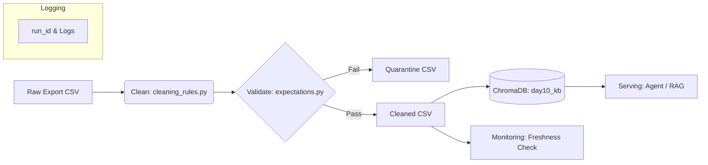

# Kiến trúc pipeline — Lab Day 10

**Nhóm:** Data Engineering Squad
**Cập nhật:** 10/06/2026

---

## 1. Sơ đồ luồng (bắt buộc có 1 diagram: Mermaid / ASCII)

> Vẽ thêm: điểm đo **freshness**, chỗ ghi **run_id**, và file **quarantine**.

---

## 2. Ranh giới trách nhiệm

| Thành phần | Input | Output | Owner nhóm |
|------------|-------|--------|--------------|
| Ingest | File CSV raw | Dict memory | Lý Hải Long |
| Transform | Dict memory | Cleaned & Quarantine Dicts | Lý Hải Long |
| Quality | Cleaned Dicts | Pass/Fail Signal | Lý Hải Long |
| Embed | Cleaned CSV | ChromaDB Vector Store | Thành Viên 3 |
| Monitor | Manifest JSON | Slack/Email Alerts | Thành Viên 2 |

---

## 3. Idempotency & rerun

> Mô tả: upsert theo `chunk_id` hay strategy khác? Rerun 2 lần có duplicate vector không?

- **Idempotency Strategy:** Sử dụng `col.upsert(ids=ids, documents=documents)` trong ChromaDB với khóa chính là `chunk_id`.
- **Kết quả khi rerun:** Rerun 2 lần hay n lần đều không tạo ra duplicate vector. Nếu chunk_id đã tồn tại, nó sẽ được update metadata và vector mới. Ngoài ra, pipeline có bước xóa (prune) các chunk_id cũ (tồn tại trong DB nhưng không có trong đợt Cleaned run hiện tại) để tránh "mồi cũ" tồn đọng.

---

## 4. Liên hệ Day 09

> Pipeline này cung cấp / làm mới corpus cho retrieval trong `day09/lab` như thế nào? (cùng `data/docs/` hay export riêng?)

Pipeline này trực tiếp xây dựng và làm sạch Vector Store (`day10_kb` trong ChromaDB). Tại Day 09, hệ thống Multi-Agent có thể cấu hình Retriever Tool để chọc thẳng vào Collection `day10_kb` này thay vì đọc file tĩnh trong `data/docs/`. Việc này đảm bảo Agent luôn lấy được thông tin đã qua kiểm duyệt và dọn rác.

---

## 5. Rủi ro đã biết

- Dữ liệu export bị trễ (Freshness SLA Exceeded) do lịch chạy cronjob của Ingestion bị treo.
- Thuật toán Document Expansion (điều chỉnh text cho dễ search) hiện đang hardcode bằng Regex, khó mở rộng nếu schema thay đổi.
